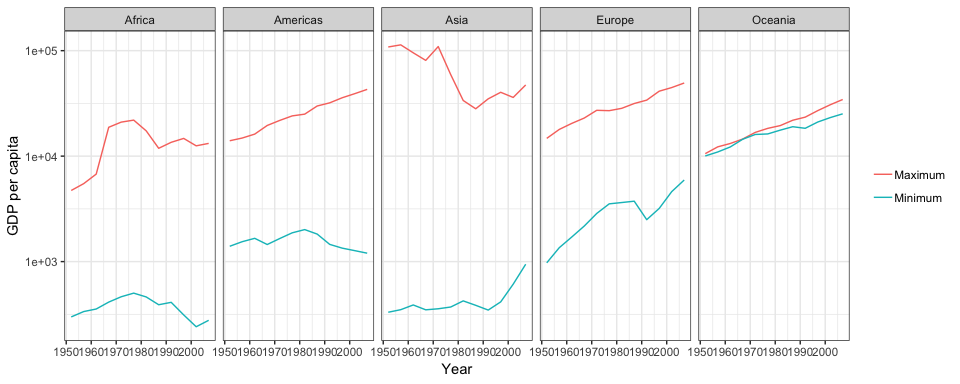

Homework 03: Use dplyr/ggplot2 to manipulate and explore data
================
Roger Yu-Hsiang Lo
2018-10-02

-   [Bring rectangular data in](#bring-rectangular-data-in)
-   [Task 1: Maximum and minimum of GDP per capita within the continents](#task-1-maximum-and-minimum-of-gdp-per-capita-within-the-continents)
-   [Task 2: Life expectancy change over time](#task-2-life-expectancy-change-over-time)
-   [Task 3: Who lingered longest in Asia?](#task-3-who-lingered-longest-in-asia)

Bring rectangular data in
-------------------------

-   Load the `Gapminder` data and `tidyverse` package:

``` r
library(gapminder)
library(tidyverse)
```

-   Some sanity check to make sure the `Gapminder` data was loaded properly:

``` r
head(gapminder) %>%
  knitr::kable(.)
```

| country     | continent |  year|  lifeExp|       pop|  gdpPercap|
|:------------|:----------|-----:|--------:|---------:|----------:|
| Afghanistan | Asia      |  1952|   28.801|   8425333|   779.4453|
| Afghanistan | Asia      |  1957|   30.332|   9240934|   820.8530|
| Afghanistan | Asia      |  1962|   31.997|  10267083|   853.1007|
| Afghanistan | Asia      |  1967|   34.020|  11537966|   836.1971|
| Afghanistan | Asia      |  1972|   36.088|  13079460|   739.9811|
| Afghanistan | Asia      |  1977|   38.438|  14880372|   786.1134|

Task 1: Maximum and minimum of GDP per capita within the continents
-------------------------------------------------------------------

Suppose that we are interested in the maximum and minimum of GDP per capita in the year of 2007 across continents. The results are summarized in the following table:

``` r
gapminder %>%
  filter(year == 2007) %>%
  group_by(continent, year) %>%
  summarise(maxGDPPercap = max(gdpPercap), minGDPPercap = min(gdpPercap)) %>%
  knitr::kable(.)
```

| continent |  year|  maxGDPPercap|  minGDPPercap|
|:----------|-----:|-------------:|-------------:|
| Africa    |  2007|      13206.48|      277.5519|
| Americas  |  2007|      42951.65|     1201.6372|
| Asia      |  2007|      47306.99|      944.0000|
| Europe    |  2007|      49357.19|     5937.0295|
| Oceania   |  2007|      34435.37|    25185.0091|

In the following plot, I try to represent this information. Of course, now that we are using a plot, we can include the maximums and minimums from all the years:

``` r
max <- gapminder %>%
  group_by(continent, year) %>%
  summarise(extreme = 'Maximum', gdpPercap = max(gdpPercap))  # Extract max data

min <- gapminder %>%
  group_by(continent, year) %>%
  summarise(extreme = 'Minimum', gdpPercap = min(gdpPercap))  # Extract min data

range <- rbind(max, min)  # Combine the two data frames

ggplot(range, aes(x = year, y = gdpPercap, color = extreme)) +
  theme_bw() +
  geom_line() +
  facet_grid(~ continent) +
  scale_y_log10() +  # Change the scale
  labs(x = 'Year', y = 'GDP per capita') +  # Add labels
  theme(legend.title = element_blank())  # Remove legend title
```



We can see that the range of GDP per capita within Oceania was very small over the years (but again only the data from Australia and New Zealand are included in this data set...), and that the range is biggest in Asia overall. We can also observe that the gap between the highest and lowest GDP per capita was increasing in Americas.

Similarly, we can investigate how the range associated with life expectancy changed over time across different continents:

``` r
max <- gapminder %>%
  group_by(continent, year) %>%
  summarise(extreme = 'Maximum', lifeExp = max(lifeExp))

min <- gapminder %>%
  group_by(continent, year) %>%
  summarise(extreme = 'Minimum', lifeExp = min(lifeExp))

range <- rbind(max, min)

ggplot(range, aes(x = year, y = lifeExp, color = extreme)) +
  theme_bw() +
  geom_line() +
  facet_grid(~ continent) +
  labs(x = 'Year', y = 'Life expectancy') +
  theme(legend.title = element_blank())
```


We see that both maximums and minimums of life expectancy shifted upward over the years within each continent. Furthermore, for Americas and Europe, the gap between the extremes was closing through time. Also notice that the maximum life expectancy was approximately the same in 2007 across continents.

Task 2: Life expectancy change over time
----------------------------------------

For the purpose of displaying data in a (reasonably sized) tabular format, I first categorized the data into three year groups (`1952-1967`, `1972-1987`, and `1992-2007`) and then calculated the mean life expectancy in each year group over all the countries within a continent.

``` r
gapminder %>%
  filter(continent != 'Oceania') %>%  # Exclude data from Oceania since only two countries are in this group
  mutate(yearGroup = if_else(year <= 1967,
                             '1952-1967',
                             if_else(year >= 1992,
                                     '1992-2007',
                                     '1972-1987'))) %>%  # Divide the data into three year groups
  group_by(yearGroup, continent) %>%
  summarize(meanLifeExp = mean(lifeExp)) %>%
  knitr::kable(.)
```

| yearGroup | continent |  meanLifeExp|
|:----------|:----------|------------:|
| 1952-1967 | Africa    |     42.26396|
| 1952-1967 | Americas  |     57.01245|
| 1952-1967 | Asia      |     50.46495|
| 1952-1967 | Europe    |     67.34710|
| 1972-1987 | Africa    |     50.49225|
| 1972-1987 | Americas  |     65.27651|
| 1972-1987 | Asia      |     61.09974|
| 1972-1987 | Europe    |     72.29034|
| 1992-2007 | Africa    |     53.83978|
| 1992-2007 | Americas  |     71.68725|
| 1992-2007 | Asia      |     68.63002|
| 1992-2007 | Europe    |     76.07362|

The plot shows the distribution of life expectancy within each continent over the years. The green points represent the countries with life expectancy above the global average in that particular year, while the red points the countries with life expectancy below the global average.

``` r
gapminder %>%
  filter(continent != 'Oceania') %>%
  group_by(year) %>%
  mutate(avgLifeExp = mean(lifeExp)) %>%
  ggplot(aes(x = continent, y = lifeExp)) +
  theme_bw() +  # Change theme
  geom_violin(aes(x = continent, y = lifeExp)) +
  geom_jitter(alpha = 0.5, aes(color = lifeExp > avgLifeExp)) +  # Add points with colors according to the mean
  facet_wrap(~ year) +
  labs(x = 'Continent', y = 'Life expectancy') +
  theme(legend.position = 'none')
```


As can be seen from the plot, the majority of African countries and some Asian countries were below average in terms of life expectancy through the four decades, while almost all European countries were above average in the same period of time. Notice also the upward shift of life expectancy for the countries in Americas over the years.

Task 3: Who lingered longest in Asia?
-------------------------------------

The table (be warned: the table is a bit looooong) below shows the top five countries in Asia that have the longest life expectancy:

``` r
gapminder %>%
  filter(continent == 'Asia') %>%  # Extract Asia data
  select(country, year, lifeExp) %>%  # Remove irrelevant columns
  group_by(year) %>%
  top_n(5, lifeExp) %>%  # Select the top 5 countries with regard to lifeExp
  arrange(year, -lifeExp) %>%
  knitr::kable(.)
```

| country          |  year|  lifeExp|
|:-----------------|-----:|--------:|
| Israel           |  1952|   65.390|
| Japan            |  1952|   63.030|
| Hong Kong, China |  1952|   60.960|
| Singapore        |  1952|   60.396|
| Taiwan           |  1952|   58.500|
| Israel           |  1957|   67.840|
| Japan            |  1957|   65.500|
| Hong Kong, China |  1957|   64.750|
| Singapore        |  1957|   63.179|
| Taiwan           |  1957|   62.400|
| Israel           |  1962|   69.390|
| Japan            |  1962|   68.730|
| Hong Kong, China |  1962|   67.650|
| Singapore        |  1962|   65.798|
| Taiwan           |  1962|   65.200|
| Japan            |  1967|   71.430|
| Israel           |  1967|   70.750|
| Hong Kong, China |  1967|   70.000|
| Singapore        |  1967|   67.946|
| Taiwan           |  1967|   67.500|
| Japan            |  1972|   73.420|
| Hong Kong, China |  1972|   72.000|
| Israel           |  1972|   71.630|
| Singapore        |  1972|   69.521|
| Taiwan           |  1972|   69.390|
| Japan            |  1977|   75.380|
| Hong Kong, China |  1977|   73.600|
| Israel           |  1977|   73.060|
| Singapore        |  1977|   70.795|
| Taiwan           |  1977|   70.590|
| Japan            |  1982|   77.110|
| Hong Kong, China |  1982|   75.450|
| Israel           |  1982|   74.450|
| Taiwan           |  1982|   72.160|
| Singapore        |  1982|   71.760|
| Japan            |  1987|   78.670|
| Hong Kong, China |  1987|   76.200|
| Israel           |  1987|   75.600|
| Kuwait           |  1987|   74.174|
| Singapore        |  1987|   73.560|
| Japan            |  1992|   79.360|
| Hong Kong, China |  1992|   77.601|
| Israel           |  1992|   76.930|
| Singapore        |  1992|   75.788|
| Kuwait           |  1992|   75.190|
| Japan            |  1997|   80.690|
| Hong Kong, China |  1997|   80.000|
| Israel           |  1997|   78.269|
| Singapore        |  1997|   77.158|
| Kuwait           |  1997|   76.156|
| Japan            |  2002|   82.000|
| Hong Kong, China |  2002|   81.495|
| Israel           |  2002|   79.696|
| Singapore        |  2002|   78.770|
| Korea, Rep.      |  2002|   77.045|
| Japan            |  2007|   82.603|
| Hong Kong, China |  2007|   82.208|
| Israel           |  2007|   80.745|
| Singapore        |  2007|   79.972|
| Korea, Rep.      |  2007|   78.623|

A table is probably not the most efficient way to display this information, the corresponding plot is shown below:

``` r
# Reference: https://drsimonj.svbtle.com/ordering-categories-within-ggplot2-facets

top <- gapminder %>%
  filter(continent == 'Asia') %>%
  select(country, year, lifeExp) %>%
  group_by(year) %>%
  top_n(5, lifeExp) %>%
  ungroup() %>%
  arrange(year, lifeExp) %>%
  mutate(order = row_number())  # This is purely for the plotting purpose

ggplot(top, aes(x = order, y = lifeExp, group = year, fill = country)) +
  theme_bw() +
  geom_bar(stat = 'identity') +
  geom_text(aes(label = top$country, y = 1), hjust = 0, size = 3) +  # Add texts on the bars
  facet_wrap(~ year, scales = 'free_y') +
  labs(x = 'Country', y = 'Life expectancy') +
  theme(axis.text.y = element_blank(),  # Remove the text and ticks of the y axis
        axis.ticks.y = element_blank(),
        legend.position = 'none') +
  coord_flip()  # Switch the x and y axises
```


It is not hard to see that the all-time winners over the years are Japan, Hong Kong, and Israel. But well I don't really want to live that long...
